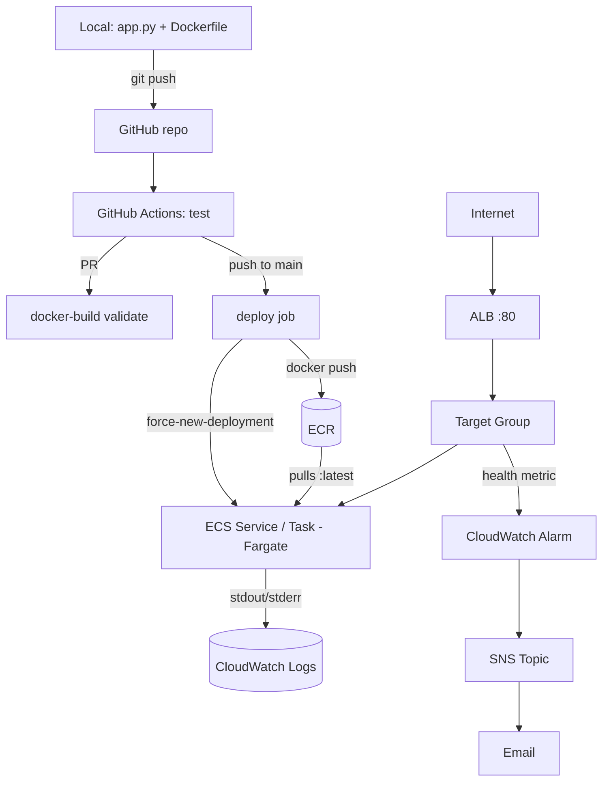

# task-tracker

A minimal Flask task-tracker API, deployed through a complete CI/CD pipeline to AWS. The app itself is intentionally simple. This project is a demonstration of the pipeline around it: automated testing, containerization, infrastructure as code, continuous deployment, and monitoring.


## Architecture



All AWS infrastructure inside the pipeline (VPC, ALB, ECS Fargate service, CloudWatch, SNS) is defined declaratively in [`infra/main.tf`](infra/main.tf) and provisioned with Terraform.

## Stack

- **App**: Python / Flask, tested with `pytest`
- **Containerization**: Docker
- **CI/CD**: GitHub Actions
- **Registry**: AWS ECR
- **Compute**: AWS ECS on Fargate (serverless containers)
- **Networking**: VPC, Application Load Balancer
- **IaC**: Terraform
- **Monitoring**: CloudWatch Logs + Alarms, SNS email notifications

## How it works

1. Every push/PR runs the test suite and validates the Docker image builds (`.github/workflows/ci.yml`).
2. Merging to `main` additionally builds and pushes the image to ECR (tagged `:latest` and by commit SHA), then forces ECS to roll out the new version behind the load balancer.
3. The ALB's target group health feeds a CloudWatch alarm; if the running container fails its `/health` check, an SNS topic emails a notification.

## Running locally

```bash
python -m venv .venv
.venv\Scripts\activate  # or `source .venv/bin/activate` on Linux/macOS
pip install -r requirements.txt
pytest -v
python app.py
```

## Deploying

```bash
docker build -t task-tracker:latest .
cd infra
terraform init
terraform apply
```

Outputs the public ALB URL. **Run `terraform destroy` when done**, the ALB and Fargate task bill hourly regardless of traffic.

## Known limitations / next steps

- **IAM**: the CI/CD user currently has `AdministratorAccess` for simplicity. A production setup would scope this to the exact ECR/ECS/CloudWatch actions needed, or use GitHub OIDC federation instead of long-lived access keys.
- **Terraform state**: stored locally rather than in a remote backend (S3 + DynamoDB lock).
- **No HTTPS**: the ALB currently serves plain HTTP. A custom domain + ACM certificate would be the next addition.
